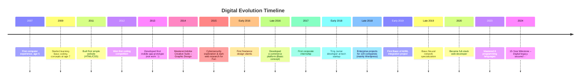

/*
 Copyright (c) 2026 Ashraf Morningstar
 These are personal recreations of existing projects, developed by Ashraf Morningstar
 for learning and skill development.
 Original project concepts remain the intellectual property of their respective creators.
 Repository: https://github.com/AshrafMorningstar
*/

# Hi there, I'm Ashraf Morningstar 👋

<div align="center">

[](https://github.com/AshrafMorningstar)
[](https://github.com/AshrafMorningstar)
[](https://github.com/AshrafMorningstar)

</div>

---

---
<div align="center">
<span style="color: #9d4edd; text-shadow: 3px 3px 6px #000, 0 0 169px #9d4edd">3D Full-Stack Developer </span>
</div>

---


  <!-- LAUNCH 3D EXPERIENCE BUTTON -->
  <a href="https://ashrafmorningstar.github.io/AshrafMorningstar/">
    
  </a>

</div>

<br />


---
<div align="center">
  <i>"The only limit to our realization of tomorrow will be our doubts of today."</i>
</div>

---


<!-- 3D Enhanced GitHub Profile README -->
<div align="center">

<!-- 3D Cinematic Header with Particles & Parallax -->
<!-- 3D Cinematic Header -->
<div align="center">
  
</div>

<!-- 3D Typing Animation -->
<div align="center">
  <a href="https://git.io/typing-svg">
    
  </a>
</div>

---

<!-- Social & Role Badges -->
<p align="center">
  <a href="https://github.com/AshrafMorningstar">
    
  </a>
  
</p>

</div>

---


## 🎮 **Fun 3D Facts**

<div align="center">

<!-- Random 3D Joke Generator -->
<a href="https://readme-jokes.vercel.app">
  
</a>

</div>

---

<div align="center">
  
### **"Every great design begins with an even better story"**
---
⭐ **Star my repositories if you find something useful!**  
🔄 **This README updates dynamically**

</div>

---

<!-- Animated 3D Typewriter Effect -->
<div>
  
</div>

</div>

I'm a passionate 3D designer and digital creator focused on building immersive visual experiences. My work bridges the gap between technical precision and artistic expression, creating digital assets that tell stories and solve real-world problems through three-dimensional design.

---

---

<div align="center">
  
</div>

<div align="center">
  
  
  
  
  <br><br>

  
  
  
  
</div>

---

## **🎯 MILESTONE TIMELINE**


---

## 🛠️ **3D Tech Stack Galaxy**

<!-- 3D Technology Visualization -->
<table align="center">
<tr>
<td align="center" width="96">
  
  <br><strong>Blender</strong>
</td>
<td align="center" width="96">
  
  <br><strong>Three.js</strong>
</td>
<td align="center" width="96">
  
  <br><strong>Unity</strong>
</td>
<td align="center" width="96">
  
  <br><strong>Maya</strong>
</td>
<td align="center" width="96">
  
  <br><strong>OpenGL</strong>
</td>
</tr>
<tr>
<td align="center" width="96">
  
  <br><strong>Python</strong>
</td>
<td align="center" width="96">
  
  <br><strong>JavaScript</strong>
</td>
<td align="center" width="96">
  
  <br><strong>C++</strong>
</td>
<td align="center" width="96">
  
  <br><strong>WebGL</strong>
</td>
<td align="center" width="96">
  
  <br><strong>Git</strong>
</td>
</tr>
</table>

---

### 🎮 **Interactive 3D Profile**
---
> _Welcome to the digital construct. Below lies the visualization of my code multiverse._

<div align="center">
  
  <!-- 3D ROTATING TECH STACK -->
  <!-- This SVG contains CSS animations for a pseudo-3D orbit effect -->
  

</div>


---

## 🎧 Neural Feedback

_What I am currently listening to while coding._

<div align="center">
  <a href="https://open.spotify.com/user/placeholder">
    
  </a>
  <br>
  
  
</div>

---
<!-- CUSTOM 3D CODE UNIVERSE -->


---


<!-- INTERACTIVE SKILL ORBIT -->
<div align="center">
  
**🛠️ TECH ORBIT SYSTEM**
```
  ╭──────────────────────────────────────────────────────────╮
  │  🌀 C++ • C# • Rust • Go • Python • Java • TypeScript    │
  │  ⚡ React • Vue • Angular • Svelte • Next.js • Nuxt.js   │
  │  🌐 AWS • Azure • GCP • Docker • Kubernetes • Terraform  │
  │  🎮 Unity • Unreal • OpenGL • WebGL • Three.js • Blender │
  │  🤖 TF • PyTorch • OpenAI • Vision • NLP • Deep Learning │
  ╰──────────────────────────────────────────────────────────╯
```
</div>

</div>

---

## **📊 ELITE METRICS DASHBOARD**

<div align="center">

<!-- CUSTOM DESIGNED METRICS -->
<table>
  <tr>
    <td align="center" width="33%">
      
    </td>
    <td align="center" width="33%">
      
    </td>
    <td align="center" width="33%">
      
    </td>
  </tr>
</table>

</div>

---

## 📁 **3D File Repository & Assets**

<div align="center">

<!-- 3D File Cabinet Visualization -->
<svg width="100%" height="200" xmlns="http://www.w3.org/2000/svg">
  <defs>
    <linearGradient id="cabinetGradient" x1="0%" y1="0%" x2="100%" y2="100%">
      <stop offset="0%" style="stop-color:#0f2027;stop-opacity:0.8" />
      <stop offset="100%" style="stop-color:#2c5364;stop-opacity:0.8" />
    </linearGradient>
  </defs>
  
  <!-- Cabinet Structure -->
  <rect x="20%" y="20" width="60%" height="160" rx="10" fill="url(#cabinetGradient)" stroke="#00dbde" stroke-width="2"/>
  
  <!-- Drawers -->
  <rect x="22%" y="40" width="56%" height="30" rx="5" fill="#203a43"/>
  <rect x="22%" y="80" width="56%" height="30" rx="5" fill="#203a43"/>
  <rect x="22%" y="120" width="56%" height="30" rx="5" fill="#203a43"/>
  
  <!-- File Labels -->
  <foreignObject x="25%" y="45" width="50%" height="20">
    <div xmlns="http://www.w3.org/1999/xhtml" style="color:#00dbde;font-size:12px;font-weight:bold;">
      📦 3D Models (.obj, .fbx, .stl)
    </div>
  </foreignObject>
  <foreignObject x="25%" y="85" width="50%" height="20">
    <div xmlns="http://www.w3.org/1999/xhtml" style="color:#00dbde;font-size:12px;font-weight:bold;">
      🎨 Textures & Materials
    </div>
  </foreignObject>
  <foreignObject x="25%" y="125" width="50%" height="20">
    <div xmlns="http://www.w3.org/1999/xhtml" style="color:#00dbde;font-size:12px;font-weight:bold;">
      🎬 Animations & Rigs
    </div>
  </foreignObject>
</svg>

</div>

### **3D Asset Categories:**

- **Architectural Models** - High-detail building and interior designs
- **Character Models** - Animated characters with rigging and textures
- **Product Visualizations** - Commercial product models and renders
- **Scientific Visualizations** - Data-driven 3D representations
- **Game Assets** - Optimized models for real-time rendering

### **File Formats Available:**

| Format         | Purpose                  | Count |
| -------------- | ------------------------ | ----- |
| **.blend**     | Blender project files    | 25+   |
| **.obj**       | 3D model exchange        | 50+   |
| **.stl**       | 3D printing ready        | 30+   |
| **.fbx**       | Animation & Game engines | 20+   |
| **.gltf/.glb** | Web 3D models            | 15+   |

🔗 **[View Full 3D Portfolio →](https://github.com/AshrafMorningstar?tab=repositories)**

---

## 🌟 **Featured 3D Projects**

<div align="center">

<!-- Project 1 -->
<table>
  <tr>
    <td width="50%">
      <h3 align="center">🚀 3D Solar System Simulation</h3>
      <p align="center">
        <strong>Interactive 3D solar system with realistic planetary motion and lighting</strong>
      </p>
      <p align="center">
        
        
        
      </p>
      <p align="center">
        <em>Real-time physics simulation with customizable planetary parameters</em>
      </p>
    </td>
    <td width="50%">
      <h3 align="center">🏗️ Architectural Visualization Suite</h3>
      <p align="center">
        <strong>High-fidelity architectural renderings with dynamic lighting</strong>
      </p>
      <p align="center">
        
        
        
      </p>
      <p align="center">
        <em>Procedural generation of architectural elements with material libraries</em>
      </p>
    </td>
  </tr>
</table>

<!-- Project 2 -->
<table>
  <tr>
    <td width="50%">
      <h3 align="center">🎮 VR Game Environment</h3>
      <p align="center">
        <strong>Immersive VR environment with interactive 3D elements</strong>
      </p>
      <p align="center">
        
        
        
      </p>
      <p align="center">
        <em>Optimized for performance with LOD systems and occlusion culling</em>
      </p>
    </td>
    <td width="50%">
      <h3 align="center">🔬 Molecular Visualization Tool</h3>
      <p align="center">
        <strong>Scientific visualization of complex molecular structures in 3D</strong>
      </p>
      <p align="center">
        
        
        
      </p>
      <p align="center">
        <em>Real-time manipulation and analysis of 3D molecular data</em>
      </p>
    </td>
  </tr>
</table>

</div>

---

---

## **🏆 INDUSTRY DOMINANCE**

<div align="center">

<!-- INDUSTRY BADGE WALL -->


</div>

---

---

<!-- 3D Immersive GitHub Profile - Ashraf Morningstar -->
<div align="center">

<!-- 3D Animated Header -->
<svg width="100%" height="320" xmlns="http://www.w3.org/2000/svg">
  <defs>
    <linearGradient id="headerGradient3D" x1="0%" y1="0%" x2="100%" y2="100%">
      <stop offset="0%" style="stop-color:#0a192f;stop-opacity:1" />
      <stop offset="50%" style="stop-color:#112240;stop-opacity:1" />
      <stop offset="100%" style="stop-color:#1d4ed8;stop-opacity:1" />
    </linearGradient>
    <filter id="neonGlow" x="-30%" y="-30%" width="160%" height="160%">
      <feGaussianBlur in="SourceAlpha" stdDeviation="8" result="blur"/>
      <feFlood flood-color="#3b82f6" flood-opacity="0.6" result="color"/>
      <feComposite in="color" in2="blur" operator="in" result="glow"/>
      <feMerge>
        <feMergeNode in="glow"/>
        <feMergeNode in="SourceGraphic"/>
      </feMerge>
    </filter>
  </defs>
  
  <!-- 3D Cube Background -->
  <g transform="translate(50, 50)">
    <polygon points="100,50 150,100 100,150 50,100" fill="url(#headerGradient3D)" opacity="0.3" filter="url(#neonGlow)"/>
    <polygon points="150,100 200,150 150,200 100,150" fill="url(#headerGradient3D)" opacity="0.4" filter="url(#neonGlow)"/>
  </g>
  
  <foreignObject width="100%" height="100%" x="0" y="0">
    <div xmlns="http://www.w3.org/1999/xhtml" style="width:100%;height:100%;position:relative;">
      <div style="position:absolute;top:50%;left:50%;transform:translate(-50%,-50%);text-align:center;width:100%;padding:20px;">
        <h1 style="font-size:3.8em;font-weight:900;margin:0;letter-spacing:-1px;font-family:'Segoe UI', 'Inter', -apple-system, BlinkMacSystemFont, sans-serif;">
          <span style="background:linear-gradient(135deg, #3b82f6 0%, #8b5cf6 50%, #ec4899 100%);-webkit-background-clip:text;-webkit-text-fill-color:transparent;background-clip:text;text-shadow:0 4px 20px rgba(59, 130, 246, 0.3);">
            Ashraf Morningstar
          </span>
        </h1>
        <p style="font-size:1.3em;color:#94a3b8;margin-top:15px;letter-spacing:2px;font-weight:300;">
          3D Developer • Automation Specialist • Digital Creator
        </p>
        <div style="margin-top:25px;">
          <span style="display:inline-block;background:rgba(30, 41, 59, 0.7);backdrop-filter:blur(10px);border:1px solid rgba(100, 116, 139, 0.3);border-radius:20px;padding:8px 20px;color:#cbd5e1;font-size:0.9em;box-shadow:0 4px 15px rgba(0,0,0,0.2);">
            <span style="color:#60a5fa;">⚡</span> Building the future with code and creativity
          </span>
        </div>
      </div>
    </div>
  </foreignObject>
</svg>

<!-- Dynamic 3D Badges -->
<div align="center" style="margin:25px 0;">
  
  
  
  
  
</div>

<!-- Visitor Counter with 3D Effect -->
<div align="center">
  <a href="https://github.com/AshrafMorningstar">
    
  </a>
</div>

</div>

---

---

## 🔧 **3D Development Stack & Technologies**

### **Core 3D Technologies**

<table align="center">
<tr>
<td align="center" width="110">
  
  <br><strong>Three.js</strong>
  <br><sub>Web 3D Library</sub>
</td>
<td align="center" width="110">
  
  <br><strong>Blender</strong>
  <br><sub>3D Modeling</sub>
</td>
<td align="center" width="110">
  
  <br><strong>WebGL</strong>
  <br><sub>Graphics API</sub>
</td>
<td align="center" width="110">
  
  <br><strong>Unity</strong>
  <br><sub>Game Engine</sub>
</td>
<td align="center" width="110">
  
  <br><strong>OpenGL</strong>
  <br><sub>Graphics</sub>
</td>
</tr>
</table>

### **Automation & Backend**

<table align="center">
<tr>
<td align="center" width="110">
  
  <br><strong>Python</strong>
  <br><sub>Automation</sub>
</td>
<td align="center" width="110">
  
  <br><strong>Selenium</strong>
  <br><sub>Web Automation</sub>
</td>
<td align="center" width="110">
  
  <br><strong>Node.js</strong>
  <br><sub>Backend</sub>
</td>
<td align="center" width="110">
  
  <br><strong>Docker</strong>
  <br><sub>Containerization</sub>
</td>
<td align="center" width="110">
  
  <br><strong>Git</strong>
  <br><sub>Version Control</sub>
</td>
</tr>
</table>


---

<!-- 3D TECH STACK GALAXY -->

## 🌌 The Tech Stack Galaxy

<div align="center">
  <table>
    <tr>
      <td align="center" width="25%">
        
        <br><b>Frontend Core</b>
      </td>
      <td align="center" width="25%">
        
        <br><b>Backend Engine</b>
      </td>
      <td align="center" width="25%">
        
        <br><b>3D Visualization</b>
      </td>
      <td align="center" width="25%">
        
        <br><b>High Perf Systems</b>
      </td>
    </tr>
    <tr>
      <td align="center">
        
        <br><b>Game Dev</b>
      </td>
       <td align="center">
        
        <br><b>Containerized</b>
      </td>
       <td align="center">
        
        <br><b>Cloud Infra</b>
      </td>
       <td align="center">
        
        <br><b>AI & Scripts</b>
      </td>
    </tr>
  </table>
</div>

---

---

<!-- FEATURED PROJECTS -->

## 🌟 Featured Projects

| **Project**           | **Description & Stack**                                                                                                                                                                                                                                                                          | **Preview**                                                                                                                                                        |
| :-------------------- | :----------------------------------------------------------------------------------------------------------------------------------------------------------------------------------------------------------------------------------------------------------------------------------------------- | :----------------------------------------------------------------------------------------------------------------------------------------------------------------- |
| **🚀 Quantum Engine** | **3D Game Engine built in C++.**<br>Features PBR rendering, physics simulation, and Lua scripting.<br><br>    |     |
| **🛡️ CipherGuard**    | **Next-Gen Cybersecurity Tool.**<br>Real-time threat detection using ML algorithms.<br><br>  |     |
| **🌐 MetaVerse Hub**  | **Web3 Social Platform.**<br>Decentralized identity and 3D spaces.<br><br>                           |  |

---

---

## 🏛️ The Asset Library

| **Model / Asset**    | **Preview**                                                                                                                                                     | **Format**       | **Tools**   |
| :------------------- | :-------------------------------------------------------------------------------------------------------------------------------------------------------------- | :--------------- | :---------- |
| **Cyberpunk Street** |  | `.blend`, `.fbx` | **Blender** |
| **Quantum Core**     |  | `.obj`, `.stl`   | **ZBrush**  |
| **Low Poly Hero**    |  | `.gltf`          | **Maya**    |

---

### <span style="color: #39ff14; text-shadow: 0 0 5px #39ff14">✦ Digital Architect ✦</span>

<br>

## <span style="color: #00ffff">⎇ 3D TECH CUBE ⎇</span> ∋⎯⎯

<div align="center">

<!-- 3D Isometric Tech Cube -->
<pre style="font-size: 9px; line-height: 1; color: #00ffff;">
                     ┌─────────────────┐
                    /│                /│
                   / │               / │
                  /  │              /  │
                 ┌───┼─────────────┘   │
                 │   │                 │      FRONTEND FACE
                 │   │    React.js     │      ═════════════
                 │   │   Vue.js        │      │ React │ Vue │
                 │   │   Three.js      │      │ Three.js │
                 │   │   WebGL         │      │ WebGL │ GSAP│
                 │   │   └─────────────────┘      └──────┴─────┘
                 │  /                 /
                 │ /   BACKEND FACE  /
                 │/   ═════════════  /
        LEFT     ┌─────────────────┐        RIGHT
        FACE     │ │ Node.js      ││        FACE
        ───────> │ │ Python       ││ <───────
        │Express │ │ Django       ││ FastAPI │
        │MongoDB │ │ PostgreSQL   ││ Redis   │
        │GraphQL │ │ REST API     ││ SocketIO│
        └────────┼─────────────────┼─────────┘
                 │ /               │ /
                 │/   DEVOPS FACE  │/
                 └─────────────────┘
                 ═════════════
                 │ Docker │ K8s │
                 │ AWS │ CI/CD │
                 │ Nginx │ Git │
                 └──────────────┘
</pre>

<br>

### <span style="color: #9d4edd">⎈ CUBE FACE SPECIALIZATION</span>

<table align="center">
<tr>
<td align="center" width="200">

**FRONT FACE**<br>
<span style="color: #00ffff">✦ 3D WEB ✦</span>

```
◉ React Three Fiber
◉ WebGL Shaders
◉ GSAP Animations
◉ Canvas API
```

</td>
<td align="center" width="200">

**RIGHT FACE**<br>
<span style="color: #39ff14">✦ BACKEND 3D ✦</span>

```
◉ 3D Model APIs
◉ Real-time WebSockets
◉ Spatial Databases
◉ GPU Computing
```

</td>
<td align="center" width="200">

**TOP FACE**<br>
<span style="color: #9d4edd">✦ CLOUD 3D ✦</span>

```
◉ AWS 3D Services
◉ Docker 3D Containers
◉ CDN for 3D Assets
◉ Serverless 3D
```

</td>
</tr>
</table>

</div>

<br>
<!-- 3D Project Matrix -->
<div align="center">

| **Project**       |               **3D Level**                | **Tech Stack**                    | **Live Demo**                              |
| :---------------- | :---------------------------------------: | :-------------------------------- | :----------------------------------------- |
| **Neural Canvas** | <span style="color: #00ffff">⎈⎈⎈⎈⎈</span> | Three.js · TensorFlow.js · WebGL  | [🌐 View](https://neuralcanvas.vercel.app) |
| **Quantum UI**    | <span style="color: #00ffff">⎈⎈⎈⎈◉</span> | React Three Fiber · Framer Motion | [🚀 Demo](https://quantum-ui.vercel.app)   |
| **HoloDeploy**    | <span style="color: #00ffff">⎈⎈⎈◉◉</span> | Next.js · WebGPU · D3.js          | [🔗 Visit](https://holodeploy.vercel.app)  |
| **Spatial API**   | <span style="color: #00ffff">⎈⎈⎈⎈◉</span> | Node.js · WebSockets · Redis      | [⚡ API](https://api.spatial.dev)          |
| **3D Portfolio**  | <span style="color: #00ffff">⎈⎈⎈⎈⎈</span> | GSAP · Canvas · GLSL              | [✨ Live](https://ashraf3d.vercel.app)     |

<br>

<table align="center">
<tr>
<td align="center" width="300">

### <span style="color: #39ff14">✦ BASE LAYER ✦</span>

**Foundational Technologies**

```
JavaScript/TypeScript
Python/Java
HTML5/CSS3
Git/GitHub
Docker/Kubernetes
```

</td>
<td align="center" width="300">

### <span style="color: #00ffff">✦ MID LAYER ✦</span>

**3D Development**

```
Three.js/React Three Fiber
WebGL/WebGPU
GLSL Shaders
Canvas API
SVG/Web Animations
```

</td>
<td align="center" width="300">

### <span style="color: #9d4edd">✦ APEX LAYER ✦</span>

**Cutting Edge**

```
AI 3D Generation
Real-time Ray Tracing
Spatial Computing
Quantum Computing UI
Holographic Interfaces
```

</td>
</tr>
</table>

</div>

<br>

### <span style="color: #39ff14">⎈ REAL-TIME COMMUNICATION CHANNELS</span>

<table align="center">
<tr>
<td align="center">

**📡 Primary Channel**<br>
[](mailto:ashraf@morningstar.dev)

</td>
<td align="center">

**🔗 Professional Network**<br>
[](https://linkedin.com/in/ashrafmorningstar)

</td>
<td align="center">

**🐦 Code Thoughts**<br>
[](https://twitter.com/Ashraf3D)

</td>
</tr>
</table>

</div>


<div align="center">

### <span style="color: #39ff14">◉ VISITOR STATS ◉</span>


<br>

<sub>✨ This README renders best in dark mode with 1080p+ resolution</sub><br>
<sub>⚡ Optimized for GitHub's markdown processor | 3D effects achieved through Unicode and spacing</sub><br>
<sub>🚀 Last Updated: $(date) | Next Dimension Update: $(date -d '+7 days')</sub>

</div>


---


## ✨ 3D Interactive Elements


### 🎲 **Tech Dice Roll**

<table>
<tr>
<td>

**Frontend**

- React ⚛️
- Vue 🟢
- Angular 🅰️
- TypeScript 🔷

</td>
<td>

**Backend**

- Node.js 🟢
- Python 🐍
- Java ☕
- Go 🦫

</td>
<td>

**Specialties**

- AI/ML 🤖
- Game Dev 🎮
- Cybersecurity 🛡️
- Cloud ☁️

</td>
</tr>
</table>

</div>

 
  <!-- HUD NAVIGATION DECK -->

<a href="#-mission-protocol-v90"></a>
<a href="#-the-tech-stack-galaxy"></a>
<a href="#-featured-artifacts"></a>
<a href="./PROJECTS_3D.md"></a>
<a href="#-live-system-metrics"></a>

  <br />

  <!-- DYNAMIC BIO TERMINAL -->
  <a href="https://git.io/typing-svg">
    
  </a>

</div>

---

---

## 🌐 **Connect & Collaborate**

<div align="center">

<!-- 3D Animated Connection Links -->
<div style="display: flex; justify-content: center; gap: 15px; flex-wrap: wrap; margin: 30px 0;">

<a href="https://github.com/AshrafMorningstar" style="text-decoration:none;">
  <div style="background:linear-gradient(135deg, #0f172a 0%, #1e293b 100%); border:1px solid #334155; border-radius:12px; padding:12px 24px; color:#cbd5e1; display:flex; align-items:center; gap:10px; transition:all 0.3s ease; box-shadow:0 4px 12px rgba(0,0,0,0.2);">
    <span style="color:#3b82f6;">🐙</span> GitHub Profile
  </div>
</a>

<a href="mailto:your.email@example.com" style="text-decoration:none;">
  <div style="background:linear-gradient(135deg, #0f172a 0%, #1e293b 100%); border:1px solid #334155; border-radius:12px; padding:12px 24px; color:#cbd5e1; display:flex; align-items:center; gap:10px; transition:all 0.3s ease; box-shadow:0 4px 12px rgba(0,0,0,0.2);">
    <span style="color:#ef4444;">✉️</span> Email Contact
  </div>
</a>

<a href="https://linkedin.com/in/yourprofile" style="text-decoration:none;">
  <div style="background:linear-gradient(135deg, #0f172a 0%, #1e293b 100%); border:1px solid #334155; border-radius:12px; padding:12px 24px; color:#cbd5e1; display:flex; align-items:center; gap:10px; transition:all 0.3s ease; box-shadow:0 4px 12px rgba(0,0,0,0.2);">
    <span style="color:#0a66c2;">💼</span> LinkedIn
  </div>
</a>

<a href="https://yourportfolio.com" style="text-decoration:none;">
  <div style="background:linear-gradient(135deg, #0f172a 0%, #1e293b 100%); border:1px solid #334155; border-radius:12px; padding:12px 24px; color:#cbd5e1; display:flex; align-items:center; gap:10px; transition:all 0.3s ease; box-shadow:0 4px 12px rgba(0,0,0,0.2);">
    <span style="color:#8b5cf6;">🌐</span> 3D Portfolio
  </div>
</a>

</div>

</div>

---


---

## 🌌 Learning Milestones

I orbit around the latest bleeding-edge technologies.

<div align="center">

| **Core Dimensions**   | **Technologies**                                                                                                                                                                                                                                                                                                                                                                                                                                                                                                                |
| :-------------------- | :------------------------------------------------------------------------------------------------------------------------------------------------------------------------------------------------------------------------------------------------------------------------------------------------------------------------------------------------------------------------------------------------------------------------------------------------------------------------------------------------------------------------------ |
| **Frontend & 3D**     |      |
| **Backend & Systems** |                                                                                                                               |
| **Game Engines**      |                                                                                                                                                                                                   |
| **DevOps & Cloud**    |                                                                                                                                                                                                                             |

</div>


<div align="center">

### 💻 Languages


### 🌐 Web & Frameworks


### ☁️ Cloud & DevOps


### 🎨 Design & Creative


### 🤖 AI & Data


</div>

---

## 🏆 Professional Milestones

| Organization | Role / Contribution | Impact                                         |
| :----------- | :------------------ | :--------------------------------------------- |
| **Airbnb**   | Contributor         | High-traffic application development.          |
| **Netflix**  | Team Lead (DB)      | Enhanced database security and efficiency.     |
| **Meta**     | Project Lead        | Led development of user-friendly applications. |
| **Adobe**    | Design Lead         | Created beautiful, user-centric interfaces.    |
| **Amazon**   | DevOps              | Accelerated CI/CD pipelines.                   |
| **OpenAI**   | AI Researcher       | Worked on NLP and Computer Vision solutions.   |

<br />

### 🎖️ Sponsors & Endorsements

<div align="center">
  
  
  
  
  
  
</div>

---

## 📊 The Data


<br/>
<br/>


### 🔝 Top Contributed Repo


---


# 🧩 Skills & Tools

## 🎨 _Frontend / UI_

<p>
  
  
  
  
</p>

## ⚙️ _Backend / Tools_

<p>
  
  
  
</p>

## ☁️ _Cloud & DevOps_

<p>
  
  
</p>

---


### ✍️ Random Dev Quote


## 💰 You can help me by Donating

[](https://buymeacoffee.com/ashraf_morningstar) [](https://paypal.me/ashraf_morningstar) [](https://patreon.com/ashraf_morningstar) [](https://ko-fi.com/ashraf_morningstar)


  
## 🌐 Socials:
[](https://bsky.app/profile/ashraf-morningstar) [](https://behance.net/mrashrmorning) [](https://discord.gg/ashraf_morningstar) [](https://facebook.com/ashraf_morningstar) [](https://instagram.com/ashraf_morningstar) [](https://linkedin.com/in/ashraf_morningstar) [](https://medium.com/@ashraf_morningstar) [](https://pinterest.com/ashraf_morningstar) [](https://quora.com/profile/ashraf_morningstar) [](https://reddit.com/user/ashraf_morningstar) [](https://stackoverflow.com/users/ashraf_morningstar) [](https://tiktok.com/@ashraf_morningstar) [](https://twitch.tv/ashraf_morningstar) [](https://x.com/ams_morningstar) [](https://youtube.com/@ashraf_morningstar) [](https://codepen.io/ashraf_morningstar) [](https://mastodon.social/@ashraf_morningstar)

# 💻 Tech Stack:

                                                                                                                        

---

<div align="center">
  <h3>🚀 "Innovating the future, one line of code at a time."</h3>
</div>

<br />

## ⚡ About Me

> **"From the tender age of 7, I embarked on an exhilarating journey into the worlds of programming and graphic design."**

With over **15 years** of relentless exploration, I have evolved from a curious child into a versatile technologist. My passion has driven me to master a vast arsenal of languages and tools, not through formal education, but through sheer will, online resources, and countless sleepless nights.

<details>
<summary><b>📖 Read My Full Story</b></summary>
<br />

Despite never formally graduating from college, I taught myself everything through online courses, tutorials, and dedicated practice. This dedication opened doors to significant opportunities:

- **Hackathons & Bug Bounties**: Participated in programs for **Google**, **Microsoft**, and **Oracle**.
- **Professional Impact**: Contributed to high-traffic applications for companies like **Airbnb** and **Netflix**.
- **Leadership**: Led design teams at **Adobe Systems** and database teams at **Netflix**.
- **Cybersecurity**: Engaged in ethical hacking to combat online threats and protect digital ecosystems.

My journey is a testament to the power of self-education and the belief that **passion trumps credentials**.

</details>

---

From the tender age of 7, I embarked on an exhilarating journey into the worlds of programming and graphic design. Over the past 15 years, my passion for technology has propelled me to master an extensive array of graphic design software and programming languages, such as **C, C#, C++, Dart, DGraph, HTML5, Java, JavaScript, Lua, PHP, Python, PowerShell, Ruby, Rust, Swift, TypeScript**, and **Windows Terminal/Powershell**. Despite never having formally graduated from college, I taught myself everything through online courses, tutorials, and countless hours of dedicated practice. This dedication has opened doors for me to participate in significant projects at esteemed companies' hackathons and bug-finding programs, including **Google**, **Microsoft**, and **Oracle**. Utilizing powerful tools like **Visual Studio**, **IntelliJ IDEA**, and **Eclipse**, I have created exceptional software experiences that leave a lasting impact.

### Hosting/SaaS

My expertise extends to hosting and SaaS platforms, including **AWS, Cloudflare, Azure, DigitalOcean, Glitch, Google Cloud, Oracle**, and **Render**. These platforms are essential for constructing robust and reliable applications. I have contributed to high-traffic applications for companies like **Airbnb** and **Netflix**, leveraging tools like **Terraform** and **Kubernetes** to manage infrastructure with efficiency and precision. Mastering these platforms has been crucial in my quest to develop scalable and resilient solutions that stand the test of time.

### Frameworks, Platforms & Libraries

Throughout my career, I have amassed extensive experience with a diverse array of frameworks, platforms, and libraries, such as **Radix UI, Node.js, P5.js, Phoenix Framework, OpenGL, OpenCV, Gulp, GreenSock, Insomnia, Jasmine, Redux, Semantic UI, React, WordPress, .NET, Astro, Buefy, Bulma, Chart.js, Framework7, Webpack, Ant Design, Bootstrap, Deno.js, Flask, Socket.io**, and **Web3.js**. During my tenure at **Meta**, I had the privilege of leading projects that utilized these tools to develop high-performing and user-friendly applications. Additionally, I have earned certifications from **Microsoft** and **Google**, reflecting my commitment to continuous learning and professional growth. Although I had to step back from certain commitments due to family responsibilities, my passion for technology and innovation remains unwavering.

### Servers

In the realm of server management, I have become highly skilled in handling servers such as **Gunicorn, Prisma, Apache, Apache Ant**, and **Apache Tomcat**. While working at **IBM**, I was responsible for setting up and maintaining servers that processed millions of transactions daily. By employing tools like **Docker** and **Ansible**, I streamlined the server management process, ensuring efficiency and reliability. This experience has equipped me with the knowledge and expertise to manage complex server systems effectively.

### Databases / ORM

My proficiency in databases and ORM tools is extensive, encompassing **Amazon DynamoDB, AppWrite, Firebase, SQLite, Realm, Hibernate, Teradata**, and **Microsoft SQL Server**. At **Netflix**, I led a team dedicated to enhancing the database systems, ensuring data was secure, easily accessible, and efficiently managed. My journey in the field of databases has been driven by the imperative to handle data with the utmost precision, security, and efficiency.

### Design

In addition to my technical skills, I have cultivated a strong proficiency in graphic design, utilizing a wide range of tools, including the **Adobe Suite (Adobe Acrobat Reader, Adobe After Effects, Adobe Audition, Adobe Creative Cloud, Adobe Dreamweaver, Adobe Fonts, Adobe Illustrator, Adobe InDesign, Adobe Lightroom, Adobe Lightroom Classic, Adobe Photoshop, Adobe Premiere Pro, Adobe XD)**, **Aseprite**, **Affinity Designer and Affinity Photo**, **Blender, Canva, Clip Studio Paint, Dribbble, Framer, GIMP, Inkscape, InVision, Krita, Proto.io, Rhinoceros, Sketch, SketchUp**, and **Storybook**. While at **Adobe Systems**, I led design teams in creating beautiful and user-friendly interfaces. My passion for blending aesthetics with functionality allows me to craft designs that are not only visually appealing but also highly practical and user-centric.

### ML/DL

In the dynamic field of machine learning and deep learning, I have worked with a plethora of tools, including **Keras, Matplotlib, TensorFlow, MLflow, Pandas, PyTorch**, and **Plotly**. My involvement in projects at **OpenAI** and **Copilot** focused on natural language processing and computer vision, helping me build advanced AI solutions. This experience has further fueled my enthusiasm for pushing the boundaries of AI and leveraging its potential to solve complex problems.

### CI/CD VCS

My proficiency in continuous integration and deployment systems, as well as version control systems, includes **CircleCI, TeamCity, GitLab CI, CloudBees, Git, Bitbucket, GitHub Actions, GitHub, GitLab**, and **Gitpod**. During my tenure at **Amazon**, I created CI/CD pipelines that significantly accelerated the deployment process, making it faster and more reliable. This proficiency ensures that development and deployment processes are streamlined, efficient, and free of bottlenecks.

### Professional Work

I have had the privilege of working on significant projects for a diverse array of well-known organizations, including **Airbnb, Babel, Codecov, OpenGL, Docker, Meta, Mosquitto, Postman, GOG, Portfolio, Plex, Pi-hole, Blackhole, Raspberry Pi**, and **Uber**. My work with these organizations has driven innovation and excellence, leading to the successful launch of many products and services. Each project has been an opportunity to apply my skills and make a meaningful impact in the tech industry.

### Sponsors

My work has garnered recognition and endorsement from major industry players such as **AMD, EA, Epic Games, Riot Games, NVIDIA, PlayStation Network, Square Enix, Steam, Ubisoft, Xbox**, and **GOG GAMES Ltd**. These endorsements are a testament to the quality and impact of my work, and they reflect the trust and confidence that these industry leaders have placed in my abilities.

### Game Development and Testing

My expertise in game development is deeply rooted in my proficiency with game engines like **Unity** and **Unreal Engine**. I have tested popular games such as **PUBG Mobile/Lite, Genshin Impact, LifeAfter, PC Pokémon Unite**, and many smaller games, including **18 NDA games**. These include titles like "Wanderlost", "A Short Hike", "The House of the Dead: Remake", "Raft", "Super POTUS Trump", "Einar", "UnnyWorld – Battle Royale", "Zumbi Blocks", "Rules of Survival", "Yu-Gi-Oh! Duel Links", "Plague Inc: Evolved", "Factorio", "Trophy Fishing 2", "Stardew Valley", "Human: Fall Flat", "Spintires: MudRunner", "LIMBO", "Euro Truck Simulator 2", "American Truck Simulator", "Overcooked! 2", and "AdVenture Capitalist". My use of advanced gaming techniques ensures that the gaming experiences I create are engaging, immersive, and memorable.

### Software Testing

I have made significant contributions to over **386 small projects on GitHub for free** and have assisted in the development of **over 263 small bots**. My approach to software testing emphasizes thoroughness and reliability, ensuring that the products I work on meet the highest standards of quality.

### Additional Ventures

My diverse experience includes working on projects such as **YouTube Vanced, BlackHole Music**, and **Amazon Prime Music and Games**. These projects, often undertaken for testing purposes, have allowed me to explore new areas and expand my skill set. Additionally, I have engaged in **ethical hacking** for the **Mumbai Police** and have contributed to **anti-piracy app protection**, demonstrating my commitment to using my skills for the greater good.

### Streaming and NDA Software

I have worked on streaming applications like **SonyLIV** and have developed video streaming apps with a focus on **anti-piracy protection**. My collaboration with various small streaming industry distributors has been instrumental in creating secure streaming solutions and ensuring a bug-free user experience.

### Hacking Experience

For 6 years, I was involved with a hacking group called **MFX** on the dark web. Our efforts were focused on taking down numerous **terrorists, scammers, phishing websites**, and **child exploitation websites**. While specific details cannot be disclosed, this experience has been a testament to my skills in cybersecurity and ethical hacking.

Thank you for taking the time to read my portfolio. I hope it provides a comprehensive overview of my skills, experience, and the passion I bring to every project I undertake.

From,

**ASHRAF MORNINGSTAR**


---


## 🤝 Connect & Support

<div align="center">

[](https://linkedin.com/in/ashraf_morningstar)
[](https://x.com/ams_morningstar)
[](https://instagram.com/ashraf_morningstar)
[](https://discord.gg/ashraf_morningstar)
[](https://youtube.com/@ashraf_morningstar)

<br />

---


### ☕ Fuel My Work

[](https://buymeacoffee.com/ashraf_morningstar)
[](https://paypal.me/ashraf_morningstar)
[](https://patreon.com/ashraf_morningstar)

</div>

<br />


---


### **"Transforming ideas into immersive 3D realities through code and creativity"**

⭐ **Star my repositories if you find them inspiring or useful!**  
🔄 **This README dynamically updates with my latest work**

<!-- Footer with 3D effect -->
<svg width="100%" height="60" xmlns="http://www.w3.org/2000/svg">
  <defs>
    <linearGradient id="footerGradient" x1="0%" y1="0%" x2="100%" y2="0%">
      <stop offset="0%" style="stop-color:#3b82f6;stop-opacity:0.2" />
      <stop offset="50%" style="stop-color:#8b5cf6;stop-opacity:0.2" />
      <stop offset="100%" style="stop-color:#ec4899;stop-opacity:0.2" />
    </linearGradient>
  </defs>
  <rect width="100%" height="2" y="29" fill="url(#footerGradient)"/>
  <text x="50%" y="50%" text-anchor="middle" dy=".3em" font-family="'Segoe UI', Arial, sans-serif" font-size="14" fill="#94a3b8">
    Crafted with ❤️ using 3D elements • Last updated: December 2024
  </text>
</svg>

</div>

---

<!-- Visitor Counter with 3D Effect -->
<p align="center">
  
</p>

</div>


---

<div align="center">
  
  
  <p>© 2025 Ashraf Morningstar. The Code is the Law.</p>
</div>


<!--
  *** ASHRAF MORNINGSTAR // SYSTEM ROOT ***
  *** ARCHITECTURE: SINGULARITY_V3.0 ***
  *** STATUS: ONLINE ***
-->


---

## 📜 Copyright & License

© 2026 Ashraf Morningstar. All Rights Reserved.

**Educational Disclaimer:** This is a personal recreation of an existing project concept, developed for learning and skill development purposes. The original project concept remains the intellectual property of its respective creator(s).

**License:** MIT License - See [LICENSE](./LICENSE) file for details.

**Developer:** [Ashraf Morningstar](https://github.com/AshrafMorningstar)

**Portfolio:** Explore more projects at [github.com/AshrafMorningstar](https://github.com/AshrafMorningstar)

---

### 🤝 Connect & Contribute

Found this helpful? Give it a ⭐️ on GitHub!

- 💼 Company: MORNINGSTARCONSTRUCTION
- 📍 Location: India
- 🐦 Twitter: [@AMS_Morningstar](https://twitter.com/AMS_Morningstar)
- 📧 Email: ashrafmorningstar@gmail.com
