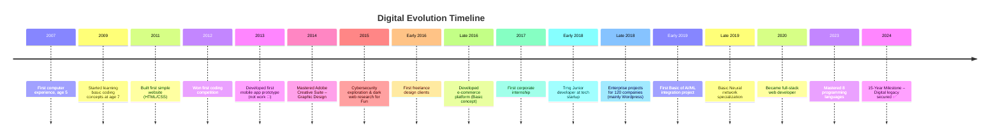

# Ashraf Morningstar — Senior Software Engineer

Senior Full-Stack & Systems Engineer with 15+ years of experience building secure, scalable production systems.

## 🔧 Core Expertise
- Full-Stack Engineering (Frontend + Backend)
- Distributed Systems & Cloud Infrastructure
- DevOps & CI/CD Automation
- Application & Payment Security (OWASP, PCI-DSS)
- Open-Source Engineering

## 🚀 Highlights
- 50+ public repositories
- 380+ open-source project contributions
- Google, Microsoft, Oracle Bug Bounty participant
- Production systems with 99.9% uptime

## 🛠 Tech Stack
**Languages:** JavaScript, TypeScript, Python, Java, C/C++, Rust  
**Cloud:** AWS, Azure, GCP, Kubernetes, Docker  
**Security:** Pen-Testing, Secure Payments, OWASP  
**CI/CD:** GitHub Actions, GitLab CI

## 📌 Philosophy
I focus on:
- Correctness before cleverness
- Secure by design systems
- Clear ownership and maintainability
- Learning fast and shipping reliably

📫 Contact: ashrafmorningstar@gmail.com  
🔗 LinkedIn: linkedin.com/in/ashrafmorningstar

# Hi there, I'm Ashraf Morningstar 👋

<div align="center">

[](https://github.com/AshrafMorningstar)
[](https://github.com/AshrafMorningstar)
[](https://github.com/AshrafMorningstar)

</div>

---

---
<div align="center">
<span style="color: #9d4edd; text-shadow: 3px 3px 6px #000, 0 0 169px #9d4edd">3D Full-Stack Developer </span>
</div>

---


  <!-- LAUNCH 3D EXPERIENCE BUTTON -->
  <a href="https://ashrafmorningstar.github.io/AshrafMorningstar/">
    
  </a>

</div>

<br />


---
<div align="center">
  <i>"The only limit to our realization of tomorrow will be our doubts of today."</i>
</div>

---


<!-- 3D Enhanced GitHub Profile README -->
<div align="center">

<!-- 3D Cinematic Header with Particles & Parallax -->
<!-- 3D Cinematic Header -->
<div align="center">
  
</div>

<!-- 3D Typing Animation -->
<div align="center">
  <a href="https://git.io/typing-svg">
    
  </a>
</div>

---

<!-- Social & Role Badges -->
<p align="center">
  <a href="https://github.com/AshrafMorningstar">
    
  </a>
  
</p>

</div>

---


## 🎮 **Fun 3D Facts**

<div align="center">

<!-- Random 3D Joke Generator -->
<a href="https://readme-jokes.vercel.app">
  
</a>

</div>

---

<div align="center">
  
### **"Every great design begins with an even better story"**
---
⭐ **Star my repositories if you find something useful!**  
🔄 **This README updates dynamically**

</div>

---

<!-- Animated 3D Typewriter Effect -->
<div>
  
</div>

</div>

I'm a passionate 3D designer and digital creator focused on building immersive visual experiences. My work bridges the gap between technical precision and artistic expression, creating digital assets that tell stories and solve real-world problems through three-dimensional design.

---

---

<div align="center">
  
</div>

<div align="center">
  
  
  
  
  <br><br>

  
  
  
  
</div>

---

## **🎯 MILESTONE TIMELINE**


---

## 🛠️ **3D Tech Stack Galaxy**

<!-- 3D Technology Visualization -->
<table align="center">
<tr>
<td align="center" width="96">
  
  <br><strong>Blender</strong>
</td>
<td align="center" width="96">
  
  <br><strong>Three.js</strong>
</td>
<td align="center" width="96">
  
  <br><strong>Unity</strong>
</td>
<td align="center" width="96">
  
  <br><strong>Maya</strong>
</td>
<td align="center" width="96">
  
  <br><strong>OpenGL</strong>
</td>
</tr>
<tr>
<td align="center" width="96">
  
  <br><strong>Python</strong>
</td>
<td align="center" width="96">
  
  <br><strong>JavaScript</strong>
</td>
<td align="center" width="96">
  
  <br><strong>C++</strong>
</td>
<td align="center" width="96">
  
  <br><strong>WebGL</strong>
</td>
<td align="center" width="96">
  
  <br><strong>Git</strong>
</td>
</tr>
</table>

---

### 🎮 **Interactive 3D Profile**
---
> _Welcome to the digital construct. Below lies the visualization of my code multiverse._

<div align="center">
  
  <!-- 3D ROTATING TECH STACK -->
  <!-- This SVG contains CSS animations for a pseudo-3D orbit effect -->
  

</div>


---

## 🎧 Neural Feedback

_What I am currently listening to while coding._

<div align="center">
  <a href="https://open.spotify.com/user/placeholder">
    
  </a>
  <br>
  
  
</div>

---
<!-- CUSTOM 3D CODE UNIVERSE -->


---


<!-- INTERACTIVE SKILL ORBIT -->
<div align="center">
  
**🛠️ TECH ORBIT SYSTEM**
```
  ╭──────────────────────────────────────────────────────────╮
  │  🌀 C++ • C# • Rust • Go • Python • Java • TypeScript    │
  │  ⚡ React • Vue • Angular • Svelte • Next.js • Nuxt.js   │
  │  🌐 AWS • Azure • GCP • Docker • Kubernetes • Terraform  │
  │  🎮 Unity • Unreal • OpenGL • WebGL • Three.js • Blender │
  │  🤖 TF • PyTorch • OpenAI • Vision • NLP • Deep Learning │
  ╰──────────────────────────────────────────────────────────╯
```
</div>

</div>

---

## **📊 ELITE METRICS DASHBOARD**

<div align="center">

<!-- CUSTOM DESIGNED METRICS -->
<table>
  <tr>
    <td align="center" width="33%">
      
    </td>
    <td align="center" width="33%">
      
    </td>
    <td align="center" width="33%">
      
    </td>
  </tr>
</table>

</div>

---

## 📁 **3D File Repository & Assets**

<div align="center">

<!-- 3D File Cabinet Visualization -->
<svg width="100%" height="200" xmlns="http://www.w3.org/2000/svg">
  <defs>
    <linearGradient id="cabinetGradient" x1="0%" y1="0%" x2="100%" y2="100%">
      <stop offset="0%" style="stop-color:#0f2027;stop-opacity:0.8" />
      <stop offset="100%" style="stop-color:#2c5364;stop-opacity:0.8" />
    </linearGradient>
  </defs>
  
  <!-- Cabinet Structure -->
  <rect x="20%" y="20" width="60%" height="160" rx="10" fill="url(#cabinetGradient)" stroke="#00dbde" stroke-width="2"/>
  
  <!-- Drawers -->
  <rect x="22%" y="40" width="56%" height="30" rx="5" fill="#203a43"/>
  <rect x="22%" y="80" width="56%" height="30" rx="5" fill="#203a43"/>
  <rect x="22%" y="120" width="56%" height="30" rx="5" fill="#203a43"/>
  
  <!-- File Labels -->
  <foreignObject x="25%" y="45" width="50%" height="20">
    <div xmlns="http://www.w3.org/1999/xhtml" style="color:#00dbde;font-size:12px;font-weight:bold;">
      📦 3D Models (.obj, .fbx, .stl)
    </div>
  </foreignObject>
  <foreignObject x="25%" y="85" width="50%" height="20">
    <div xmlns="http://www.w3.org/1999/xhtml" style="color:#00dbde;font-size:12px;font-weight:bold;">
      🎨 Textures & Materials
    </div>
  </foreignObject>
  <foreignObject x="25%" y="125" width="50%" height="20">
    <div xmlns="http://www.w3.org/1999/xhtml" style="color:#00dbde;font-size:12px;font-weight:bold;">
      🎬 Animations & Rigs
    </div>
  </foreignObject>
</svg>

</div>

### **3D Asset Categories:**

- **Architectural Models** - High-detail building and interior designs
- **Character Models** - Animated characters with rigging and textures
- **Product Visualizations** - Commercial product models and renders
- **Scientific Visualizations** - Data-driven 3D representations
- **Game Assets** - Optimized models for real-time rendering

### **File Formats Available:**

| Format         | Purpose                  | Count |
| -------------- | ------------------------ | ----- |
| **.blend**     | Blender project files    | 25+   |
| **.obj**       | 3D model exchange        | 50+   |
| **.stl**       | 3D printing ready        | 30+   |
| **.fbx**       | Animation & Game engines | 20+   |
| **.gltf/.glb** | Web 3D models            | 15+   |

🔗 **[View Full 3D Portfolio →](https://github.com/AshrafMorningstar?tab=repositories)**

---

## 🌟 **Featured 3D Projects**

<div align="center">

<!-- Project 1 -->
<table>
  <tr>
    <td width="50%">
      <h3 align="center">🚀 3D Solar System Simulation</h3>
      <p align="center">
        <strong>Interactive 3D solar system with realistic planetary motion and lighting</strong>
      </p>
      <p align="center">
        
        
        
      </p>
      <p align="center">
        <em>Real-time physics simulation with customizable planetary parameters</em>
      </p>
    </td>
    <td width="50%">
      <h3 align="center">🏗️ Architectural Visualization Suite</h3>
      <p align="center">
        <strong>High-fidelity architectural renderings with dynamic lighting</strong>
      </p>
      <p align="center">
        
        
        
      </p>
      <p align="center">
        <em>Procedural generation of architectural elements with material libraries</em>
      </p>
    </td>
  </tr>
</table>

<!-- Project 2 -->
<table>
  <tr>
    <td width="50%">
      <h3 align="center">🎮 VR Game Environment</h3>
      <p align="center">
        <strong>Immersive VR environment with interactive 3D elements</strong>
      </p>
      <p align="center">
        
        
        
      </p>
      <p align="center">
        <em>Optimized for performance with LOD systems and occlusion culling</em>
      </p>
    </td>
    <td width="50%">
      <h3 align="center">🔬 Molecular Visualization Tool</h3>
      <p align="center">
        <strong>Scientific visualization of complex molecular structures in 3D</strong>
      </p>
      <p align="center">
        
        
        
      </p>
      <p align="center">
        <em>Real-time manipulation and analysis of 3D molecular data</em>
      </p>
    </td>
  </tr>
</table>

</div>

---

---

## **🏆 INDUSTRY DOMINANCE**

<div align="center">

<!-- INDUSTRY BADGE WALL -->


</div>

---

---

<!-- 3D Immersive GitHub Profile - Ashraf Morningstar -->
<div align="center">

<!-- 3D Animated Header -->
<svg width="100%" height="320" xmlns="http://www.w3.org/2000/svg">
  <defs>
    <linearGradient id="headerGradient3D" x1="0%" y1="0%" x2="100%" y2="100%">
      <stop offset="0%" style="stop-color:#0a192f;stop-opacity:1" />
      <stop offset="50%" style="stop-color:#112240;stop-opacity:1" />
      <stop offset="100%" style="stop-color:#1d4ed8;stop-opacity:1" />
    </linearGradient>
    <filter id="neonGlow" x="-30%" y="-30%" width="160%" height="160%">
      <feGaussianBlur in="SourceAlpha" stdDeviation="8" result="blur"/>
      <feFlood flood-color="#3b82f6" flood-opacity="0.6" result="color"/>
      <feComposite in="color" in2="blur" operator="in" result="glow"/>
      <feMerge>
        <feMergeNode in="glow"/>
        <feMergeNode in="SourceGraphic"/>
      </feMerge>
    </filter>
  </defs>
  
  <!-- 3D Cube Background -->
  <g transform="translate(50, 50)">
    <polygon points="100,50 150,100 100,150 50,100" fill="url(#headerGradient3D)" opacity="0.3" filter="url(#neonGlow)"/>
    <polygon points="150,100 200,150 150,200 100,150" fill="url(#headerGradient3D)" opacity="0.4" filter="url(#neonGlow)"/>
  </g>
  
  <foreignObject width="100%" height="100%" x="0" y="0">
    <div xmlns="http://www.w3.org/1999/xhtml" style="width:100%;height:100%;position:relative;">
      <div style="position:absolute;top:50%;left:50%;transform:translate(-50%,-50%);text-align:center;width:100%;padding:20px;">
        <h1 style="font-size:3.8em;font-weight:900;margin:0;letter-spacing:-1px;font-family:'Segoe UI', 'Inter', -apple-system, BlinkMacSystemFont, sans-serif;">
          <span style="background:linear-gradient(135deg, #3b82f6 0%, #8b5cf6 50%, #ec4899 100%);-webkit-background-clip:text;-webkit-text-fill-color:transparent;background-clip:text;text-shadow:0 4px 20px rgba(59, 130, 246, 0.3);">
            Ashraf Morningstar
          </span>
        </h1>
        <p style="font-size:1.3em;color:#94a3b8;margin-top:15px;letter-spacing:2px;font-weight:300;">
          3D Developer • Automation Specialist • Digital Creator
        </p>
        <div style="margin-top:25px;">
          <span style="display:inline-block;background:rgba(30, 41, 59, 0.7);backdrop-filter:blur(10px);border:1px solid rgba(100, 116, 139, 0.3);border-radius:20px;padding:8px 20px;color:#cbd5e1;font-size:0.9em;box-shadow:0 4px 15px rgba(0,0,0,0.2);">
            <span style="color:#60a5fa;">⚡</span> Building the future with code and creativity
          </span>
        </div>
      </div>
    </div>
  </foreignObject>
</svg>

<!-- Dynamic 3D Badges -->
<div align="center" style="margin:25px 0;">
  <img src="https://img.shields.io/badge/3D_Development-Expert-3b82f6?style=for-the-badge&logo=blender&logoColor=white" al
