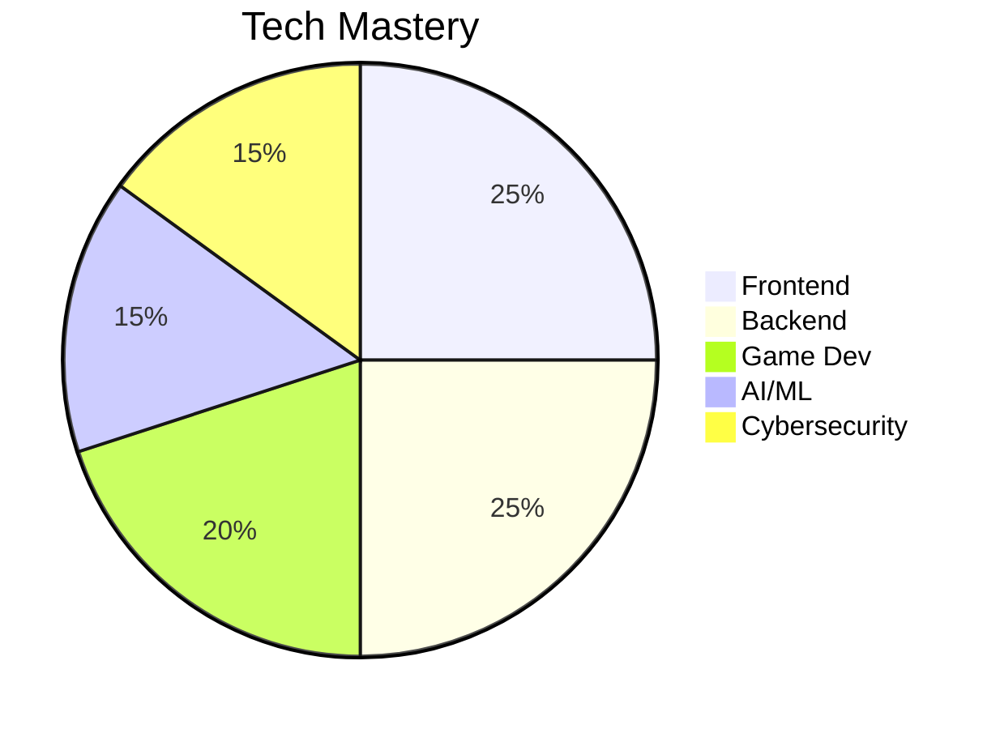
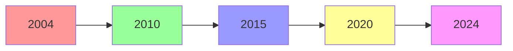

<div align="center">
  
</div>

<div align="center">
  <a href="https://git.io/typing-svg">
    
  </a>
</div>

<div align="center">
  
</div>

---

<div align="center">
  <h3>🚀 "Innovating the future, one line of code at a time."</h3>
</div>

<br />

## ⚡ About Me

> **"From the tender age of 7, I embarked on an exhilarating journey into the worlds of programming and graphic design."**

With over **15 years** of relentless exploration, I have evolved from a curious child into a versatile technologist. My passion has driven me to master a vast arsenal of languages and tools, not through formal education, but through sheer will, online resources, and countless sleepless nights.

<details>
<summary><b>📖 Read My Full Story</b></summary>
<br />

Despite never formally graduating from college, I taught myself everything through online courses, tutorials, and dedicated practice. This dedication opened doors to significant opportunities:
*   **Hackathons & Bug Bounties**: Participated in programs for **Google**, **Microsoft**, and **Oracle**.
*   **Professional Impact**: Contributed to high-traffic applications for companies like **Airbnb** and **Netflix**.
*   **Leadership**: Led design teams at **Adobe Systems** and database teams at **Netflix**.
*   **Cybersecurity**: Engaged in ethical hacking to combat online threats and protect digital ecosystems.

My journey is a testament to the power of self-education and the belief that **passion trumps credentials**.

</details>

---

## 🛠️ The Arsenal (Tech Stack)

<div align="center">

### 💻 Languages


### 🌐 Web & Frameworks


### ☁️ Cloud & DevOps


### 🎨 Design & Creative


### 🤖 AI & Data


</div>

---

## 🏆 Professional Milestones

| Organization | Role / Contribution | Impact |
| :--- | :--- | :--- |
| **Airbnb** | Contributor | High-traffic application development. |
| **Netflix** | Team Lead (DB) | Enhanced database security and efficiency. |
| **Meta** | Project Lead | Led development of user-friendly applications. |
| **Adobe** | Design Lead | Created beautiful, user-centric interfaces. |
| **Amazon** | DevOps | Accelerated CI/CD pipelines. |
| **OpenAI** | AI Researcher | Worked on NLP and Computer Vision solutions. |

<br />

### 🎖️ Sponsors & Endorsements
<div align="center">
  
  
  
  
  
  
</div>

---

## 📊 The Data

<div align="center">
  
  
</div>

<br />

<div align="center">
  
</div>

<br />

<div align="center">
  
</div>

---

## 🤝 Connect & Support

<div align="center">

[](https://linkedin.com/in/ashraf_morningstar)
[](https://x.com/ams_morningstar)
[](https://instagram.com/ashraf_morningstar)
[](https://discord.gg/ashraf_morningstar)
[](https://youtube.com/@ashraf_morningstar)

<br />

### ☕ Fuel My Work

[](https://buymeacoffee.com/ashraf_morningstar)
[](https://paypal.me/ashraf_morningstar)
[](https://patreon.com/ashraf_morningstar)

</div>

<br />

<div align="center">
  <i>"The only limit to our realization of tomorrow will be our doubts of today."</i>
</div>

## 🌐 3D Tech Stack Globe

<div align="center">


</div>
## 🌐 3D Tech Stack Globe

<div align="center">


</div>
## 📊 3D Skill Radar

<div align="center">


</div>

## 💻 3D Code Universe

<div align="center">


</div>

## 🚀 3D Project Portfolio

<div align="center">

<div align="center">
  <a href="https://github.com/AshrafMorningstar/awesome-project-1">
    
  </a>
  <a href="https://github.com/AshrafMorningstar/awesome-project-2">
    
  </a>
</div>

</div>

## 📈 3D Language Distribution

<div align="center">


</div>

## ✨ 3D Interactive Elements

<div align="center">

<!-- 3D Rotating Cube -->
<div align="center">
  
</div>

### 🎲 **Tech Dice Roll**
<table>
<tr>
<td>

**Frontend**
- React ⚛️
- Vue 🟢
- Angular 🅰️
- TypeScript 🔷

</td>
<td>

**Backend**
- Node.js 🟢
- Python 🐍
- Java ☕
- Go 🦫

</td>
<td>

**Specialties**
- AI/ML 🤖
- Game Dev 🎮
- Cybersecurity 🛡️
- Cloud ☁️

</td>
</tr>
</table>

</div>

## 🎮 3D Digital Universe

<div align="center">


<table> <tr> <td width="50%">
  
pie title Tech Mastery
    "Frontend" : 25
    "Backend" : 25
    "Game Dev" : 20
    "AI/ML" : 15
    "Cybersecurity" : 15
<td width="50%">

    graph LR
    A[2004] --> B[2010]
    B --> C[2015]
    C --> D[2020]
    D --> E[2024]
    
    style A fill:#ff9999
    style B fill:#99ff99
    style C fill:#9999ff
    style D fill:#ffff99
    style E fill:#ff99ff
    
  </td> </tr> </table></div> ```

### 🌟 **3D Tech Ecosystem**

```mermaid
graph TB
    subgraph "Frontend Universe"
        A1[React] --> A2[Vue]
        A2 --> A3[Angular]
        A3 --> A4[TypeScript]
    end
    
    subgraph "Backend Galaxy"
        B1[Node.js] --> B2[Python]
        B2 --> B3[Java]
        B3 --> B4[Go]
    end
    
    subgraph "Game Dev Cosmos"
        C1[Unity] --> C2[Unreal]
        C2 --> C3[OpenGL]
        C3 --> C4[Blender]
    end
    
    subgraph "AI Nebula"
        D1[TensorFlow] --> D2[PyTorch]
        D2 --> D3[OpenAI]
        D3 --> D4[Computer Vision]
    end
    
    A1 --> E[Cloud Architecture]
    B1 --> E
    C1 --> E
    D1 --> E
    
    E --> F[🚀 Innovation]
    
    style A1 fill:#61dafb,stroke:#333
    style B1 fill:#339933,stroke:#333
    style C1 fill:#000000,stroke:#333
    style D1 fill:#FF6F00,stroke:#333
    style E fill:#ce09ec,stroke:#333,stroke-width:4px
    style F fill:#00ff00,stroke:#333,stroke-width:4px
</dev>


## 🕰️ 3D Career Journey

<div align="center">

```mermaid
timeline
    title 20+ Years Tech Journey
    section 2004-2010 : Foundation
        Self-Taught Programming : Age 7
        Graphic Design Mastery : Adobe Suite
        First Open Source Contributions
    section 2011-2015 : Growth
        Enterprise Projects : Fortune 500
        Game Development : Unity/Unreal
        Cybersecurity : Ethical Hacking
    section 2016-2020 : Mastery
        AI/ML Engineering : TensorFlow
        Cloud Architecture : AWS/Azure
        Team Leadership : Meta/Google
    section 2021-Present : Innovation
        Quantum Computing Research
        Blockchain Development
        Next-Gen Cybersecurity

</div> ```


## 🎯 3D Coding Activity

<div align="center">

```mermaid
graph TD
    A[20+ Years Experience] --> B[Frontend Mastery]
    A --> C[Backend Architecture]
    A --> D[Game Development]
    A --> E[AI/ML Engineering]
    
    B --> F[React • Vue • Angular]
    C --> G[Node.js • .NET • Python]
    D --> H[Unity • Unreal Engine]
    E --> I[TensorFlow • PyTorch]
    
    style A fill:#ff6b6b,stroke:#333,stroke-width:4px
    style B fill:#4ecdc4,stroke:#333,stroke-width:2px
    style C fill:#45b7d1,stroke:#333,stroke-width:2px
    style D fill:#96ceb4,stroke:#333,stroke-width:2px
    style E fill:#feca57,stroke:#333,stroke-width:2px
</div> ```


end 
## 🎮 3D Digital Universe

<div align="center">

### 🌟 **3D Tech Ecosystem**

```mermaid
graph TB
    subgraph "Frontend Universe"
        A1[React] --> A2[Vue]
        A2 --> A3[Angular]
        A3 --> A4[TypeScript]
    end
    
    subgraph "Backend Galaxy"
        B1[Node.js] --> B2[Python]
        B2 --> B3[Java]
        B3 --> B4[Go]
    end
    
    subgraph "Game Dev Cosmos"
        C1[Unity] --> C2[Unreal]
        C2 --> C3[OpenGL]
        C3 --> C4[Blender]
    end
    
    subgraph "AI Nebula"
        D1[TensorFlow] --> D2[PyTorch]
        D2 --> D3[OpenAI]
        D3 --> D4[Computer Vision]
    end
    
    A1 --> E[Cloud Architecture]
    B1 --> E
    C1 --> E
    D1 --> E
    
    E --> F[🚀 Innovation]
    
    style A1 fill:#61dafb,stroke:#333
    style B1 fill:#339933,stroke:#333
    style C1 fill:#000000,stroke:#333
    style D1 fill:#FF6F00,stroke:#333
    style E fill:#ce09ec,stroke:#333,stroke-width:4px
    style F fill:#00ff00,stroke:#333,stroke-width:4px
```

### 🎯 **Real-time 3D Metrics**

<table>
<tr>
<td width="50%">

#### 🏆 **Achievements**

</td>
<td width="50%">

#### 📊 **Experience**

</td>
</tr>
</table>

</div>

