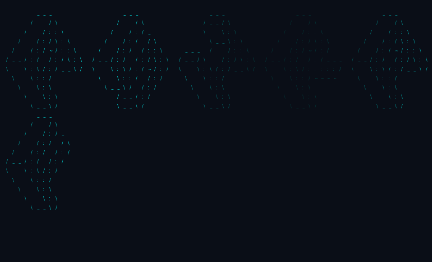
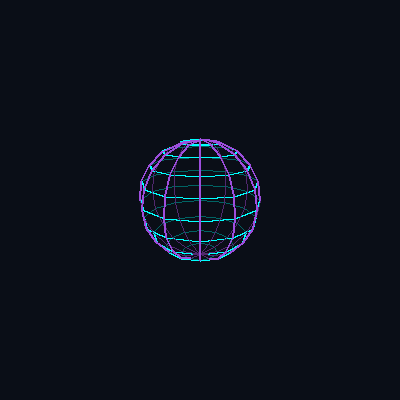
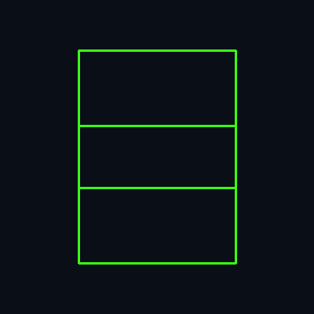
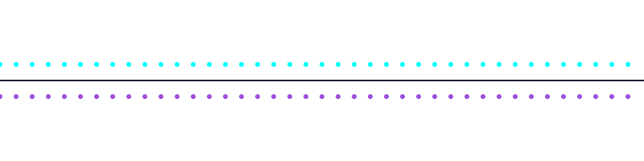
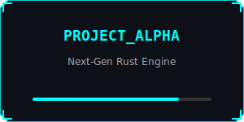
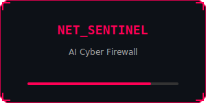
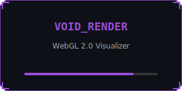

<div align="center">



<br/>

```text
    ╔══════════════════════════════════════════════════════════════════╗
    ║  SYS.ROOT > AUTHENTICATING USER... [COMPLETE]                    ║
    ║  ACCESS LEVEL: S-CLASS // OPERATOR: ASHRAF MORNINGSTAR           ║
    ║  WARNING: REALITY DISTORTION FIELD ACTIVE                        ║
    ╚══════════════════════════════════════════════════════════════════╝
```


</div>

<br/>

<!-- HUD LAYOUT TABLE -->
<table align="center" width="100%">
    <tr>
        <!-- LEFT PANEL: STATUS -->
        <td width="40%" align="center" valign="top">
            <h3 align="center">TARGET ACQUISITION</h3>
            <div align="center">
                
                <br/><br/>
                
                <br/><br/>
                <div align="left">
                    <pre>
> SYSTEM:   ONLINE
> DEFENSES: MAXIMUM
> LOCATION: CYBERSPACE
                    </pre>
                </div>
            </div>
        </td>
        
        <!-- RIGHT PANEL: CONTENT -->
        <td width="60%" valign="top">
             <!-- MISSION LOG -->
             <h3>⚡ MISSION BRIEFING</h3>
             
             <p>
                <b>Ident:</b> Ashraf Morningstar<br/>
                <b>Class:</b> Technological Architect<br/>
                <b>Objective:</b> Constructing the digital singularity.
             </p>
             
             <pre>root@morningstar:~$ cat bio.txt</pre>
             
             <blockquote>
                I am a veteran developer architecting high-performance systems for the world's leading tech giants. My code is secure, scalable, and dimensionally transcendent.
             </blockquote>

             <br/>

             <!-- SKILLS GRID -->
             <h3 align="center">[ ABILITY MATRIX ]</h3>

             <table align="center" width="100%">
                <tr>
                   <td align="center">
                      <br/>
                      <br/>
                      
                   </td>
                   <td align="center">
                      <br/>
                      <br/>
                      
                   </td>
                </tr>
             </table>

             <div align="center">
                
             </div>
        </td>
    </tr>

</table>

<!-- HOLOGRAPHIC DECK -->
<div align="center">
    
</div>

<h2 align="center">🔬 RESEARCH & DEVELOPMENT</h2>

<!-- PROJECT CARDS TABLE -->
<table align="center" width="100%">
    <tr>
        <td width="33%" align="center">
             <a href="https://github.com/AshrafMorningstar">
                 
             </a>
        </td>
        <td width="33%" align="center">
             <a href="https://github.com/AshrafMorningstar">
                 
             </a>
        </td>
        <td width="33%" align="center">
             <a href="https://github.com/AshrafMorningstar">
                 
             </a>
        </td>
    </tr>
</table>

<br/>

<h2 align="center">📊 CONTRIBUTION GALAXY</h2>

<div align="center" style="background-color: #080808; padding: 15px; border-radius: 10px; border: 1px solid #333;">
    <a href="https://github.com/AshrafMorningstar/AshrafMorningstar/actions">
        
    </a>
    <br/>
    
</div>

<br/>

<!-- FINAL FOOTER -->
<table align="center" width="100%">
    <tr>
        <td width="50%" align="center">
            
        </td>
        <td width="50%" align="center">
             <a href="https://linkedin.com/in/ashraf_morningstar"></a><br/>
             <a href="https://discord.gg/ashraf_morningstar"></a><br/>
             <a href="https://buymeacoffee.com/ashraf_morningstar"></a>
        </td>
    </tr>
</table>

<div align="center">
    
</div>
