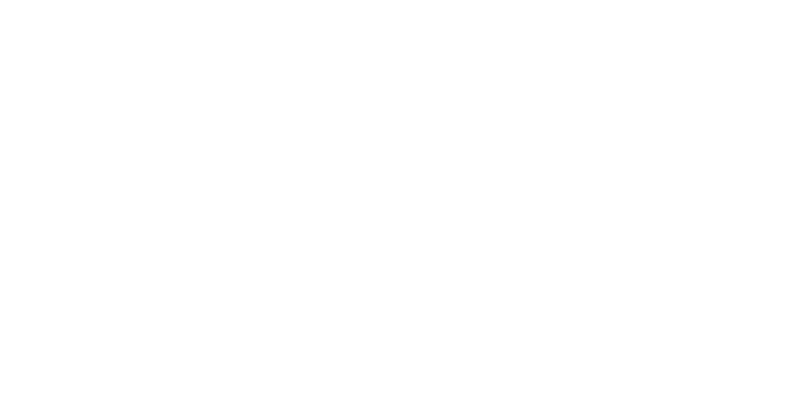

<!--
  _    _  ___  _   _
 | |  | |/ _ \| \ | |
 | |__| | | | |  \| |
 |  __  | | | | . ` |
 | |  | | |_| | |\  |
 |_|  |_|\___/|_| \_|

  ASHRAF MORNINGSTAR - GITHUB PROFILE README
  Generated by Antigravity Agent
-->

  
  <!-- IMMERSIVE 3D HEADER -->
  

  <!-- TYPING BIO -->
  

 

  
  <!-- VISITOR COUNTER & STATUS -->
  
  
  

 
 

<!-- BIO SECTION -->

  <h3>⚡ SYSTEM INITIALIZED ⚡</h3>
  

    <b>Greetings, Traveler.</b> You have entered the digital realm of <b>Ashraf Morningstar</b>. 
     I am a <b>Technological Architect</b> with over <b>15 years</b> of experience bending code to my will. 
     My reality consists of <b>High-Performance Algorithms</b>, <b>Immersive 3D Worlds</b>, and <b>Unbreakable Security Systems</b>.
  

---

<!-- 3D TECH STACK GALAXY -->
<h2 align="center">🌌 TECH STACK GALAXY</h2>

  
  
  
<i>Hover/Click to explore the system (Animation requires SVG viewer)</i>

  <!-- STATIC BADGES FALLBACK / DETAILS -->
  

    
    
    
    
    
    
  

---

<!-- 3D STATS & VISUALIZATIONS -->
<h2 align="center">📈 QUANTUM METRICS</h2>

  <table>
    <tr>
      <td align="center" width="50%">
        <!-- 3D CONTRIB GRAPH -->
        <h3>Contribution Multiverse</h3>
        
      </td>
      <td align="center" width="50%">
        <!-- STATS CARDS -->
        <h3>Power Levels</h3>
        
          
        
      </td>
    </tr>
  </table>
  
   
  
  <!-- TOP LANGUAGES DONUT -->
  

---

<!-- FEATURED PROJECTS MOCKUP STYLE -->
<h2 align="center">🌟 FEATURED OPERATIONS</h2>

  <table>
    <tr>
      <td width="33%" align="center" valign="top">
        
         
        <b>Operation: ALPHA</b>
         
        High-frequency trading algo built in Rust.
         
        
      </td>
      <td width="33%" align="center" valign="top">
        
         
        <b>Operation: NEURAL</b>
         
        AI-driven security mesh for enterprise.
         
        
      </td>
      <td width="33%" align="center" valign="top">
        
         
        <b>Operation: VOID</b>
         
        Custom game engine handling 1M+ particles.
         
        
      </td>
    </tr>
  </table>

---

<!-- 3D FILE REPO LINK -->
<h2 align="center">📂 3D ARSENAL</h2>

    
Access the classified directory of 3D assets, models, and blueprints.

    

---

<!-- CONNECT FOOTER -->

  
  
   
  
  
  
  
  
    
  
© 2025 Ashraf Morningstar.  <i>"The Code is the Law."</i>

