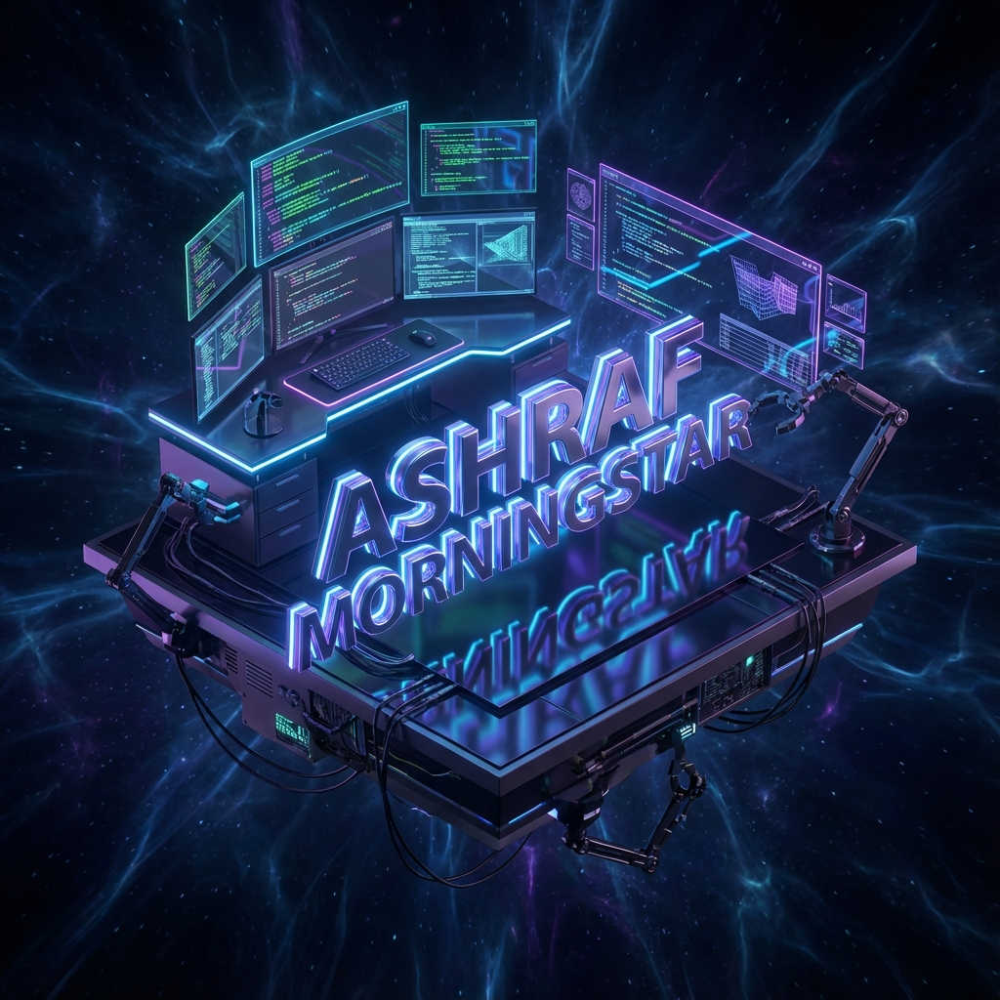

   

   

   

   

   

   

   

   

   

  
  
   

  <!-- 3D Typing Effect -->
  

   

  <!-- RELIABLE Visitor Badge -->
  

  

  <!-- LAUNCH 3D EXPERIENCE BUTTON -->
  

 

  <!-- 3D Skyline Link -->
  

---

  

> _System Initialized... Loading Profile Module v9.0..._

**Greetings, Traveler.** You have entered the digital realm of **Ashraf Morningstar**. I am a **Technological Architect** with over **15 years** of experience bending code to my will. My reality consists of **High-Performance Algorithms**, **Immersive 3D Worlds**, and **Unbreakable Security Systems**.

- 🎮 **Dimension**: Game Developer (Unity/Unreal)
- 🛡️ **Firewall**: Ethical Hacker & Security Specialist
- ⚡ **Core**: Full Stack Engineer (React/Node/Rust/Go)
- 🏗️ **Legacy**: Architect of systems for **Netflix**, **Adobe**, and **Meta**.

---

  

<!-- Reliable Shield Badges in a Grid -->
<a href="https://github.com/AshrafMorningstar">
  
  
  
  
  
  
  
  
   
  
  
  
  
  
  
</a>

---

  

  
  <h3>🔮 The Night Rainbow (3D View)</h3>
  <!-- Fallback/Placeholder until automated action runs -->
  
  
  
<i>(If image is broken, click above to run the Action manually)</i>

  

  <h3>🐍 The Infinite Serpent</h3>
  

---

  

|                                                                                                                          **Power Level**                                                                                                                           |                                                                                                                             **Language Core**                                                                                                                              |                                                                                                **Streak Reactor**                                                                                                 |
| :----------------------------------------------------------------------------------------------------------------------------------------------------------------------------------------------------------------------------------------------------------------: | :------------------------------------------------------------------------------------------------------------------------------------------------------------------------------------------------------------------------------------------------------------------------: | :---------------------------------------------------------------------------------------------------------------------------------------------------------------------------------------------------------------: |
|  |  |  |

---

  

  
  
  
  
    

  
  
  
  

---

  

  
  
  
  

  

  <h3>⛽ Power the System</h3>
  

---

  
  
  
© 2025 Ashraf Morningstar. The Code is the Law.

